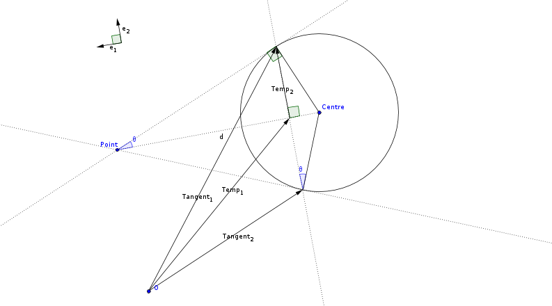

Predicting Solar Eclipses: Part IB Computing Prize Problem
==========================================================

:Author: Leonhard Markert
:Date:   20 March 2012

Task
----

Numerically integrate the orbits of celestial bodies in order to predict
when solar eclipses will occur. Given are the positions, velocities,
masses, and radii of the Moon, Earth, and Sun at midnight on the
beginning of 7 January, 2008.

Implementation
--------------

The source code of this project is laid out as follows::

  src/ 
  |-- libtwilight/ 
  |   |-- date.cc 
  |   |-- date.hh 
  |   |-- geometry.cc 
  |   |-- geometry.hh 
  |   |-- libtwilight.hh 
  |   |-- numerics.cc 
  |   |-- numerics.hh 
  |   |-- physics.cc 
  |   `-- physics.hh 
  `-- twilightbin/ 
      |-- main.cc 
      |-- utils.cc 
      `-- utils.hh

Of these files, ``physics.cc``, ``numerics.cc`` and ``geometry.cc`` are
the most important ones and will be discussed in the following sections.
``date.cc`` contains an implementation of a minimal ``Date`` class used
to output the dates at which solar eclipses occur. ``main.cc`` and
``utils.cc`` parse the command line options and contain the program’s
main loop.

Physics
-------

The physics of the problem is modelled as a system (class ``System``)
containing a list of bodies (of type struct ``Body``) as well as their
current positions and velocities. ``Body`` is just a collection of
properties: It has fields mass, radius, and name.

The physical simulation is done in the ``System.pulse`` method. It
advances the state of the system by one time step, recalculating all the
bodies’ positions and velocities by calling the appropriate numerical
integration method. These, in turn, make use of ``System.gravitate``,
which calculates the gravitational accelerations acting on each body in
the system due to all other bodies.

Numerics
--------

``numerics.cc`` consists of five functions, each corresponding to one
method of numerical integration: ``Euler``, ``Heun`` (also known as
Predictor-Corrector), ``Gauss`` (Gaussian Quadrature using five points),
Fourth Order Runge-Kutta (``RK4``), or Runge-Kutta-Fehlberg (``RKF``).

Geometry
--------

Checking whether the centres of Earth and Moon are within a constant
angle as seen from the Sun proved not to be a very reliable method of
predicting solar eclipses. Instead, the program checks the actual
geometry of the constellation to see if there is an eclipse.

Firstly, the coordinates of the three bodies are projected onto a plane.
Then, the tangents from the Sun to Moon and Earth are found via
construction of the homothetic centre. If the Moon is between the
external Sun–Earth bitangent lines, then there is a solar
eclipse.

   Finding the tangents to a circle by construction of the homothetic
   centre.

   The Moon is not between the Sun-Earth tangents: No solar eclipse.

Data Types
----------

Initially, I wrote my own Vector3D class to deal with the positions of
the bodies in 3D space. The System class contained a
``vector<Vector3D>`` for the positions and one for the velocities of its
bodies.

After a bit of research, I discovered the ``Eigen`` linear algebra C++
library. It is very fast and easy to use and reduced the amount of
boilerplate code I had to write for each batch of vector calculation
enormously. Now, the positions and velocities are stored in an
``Array3Xd`` each. An ``Array3Xd`` is a matrix with three rows and a
variable number of columns where each component has double precision
(hence the d). The individual position and velocity vectors of the
bodies are the columns of the respective matrices.

Usage
-----

``twilight -h`` shows the list of options and their defaults::

  Options:

  -h [ --help ]              print help message
  -n [ --days ] arg (=3650)  set duration of simulation (days)
  -d [ --dt ] arg (=0.002)   set time step (days)
  -m [ --method ] arg (=rkf) set integration method: 'euler',
                            'heun', 'gauss', 'rk4', or 'rkf'

Example: To run the simulation using the start data given on the
exercise web page (saved in ``system.in``) for twenty years (from 7
January, 2008) using the Fourth Order Runge-Kutta method and a time step
of 0.003 days, use ``twilight -n 7300 -d 0.003 -m rk4 < system.in >
/dev/null``. This will discard the calculated positions (via ``stdout``)
to ``/dev/null`` and print the dates at which it predicts solar eclipses
to the screen (via ``stderr``).

Results
-------

After many test runs, I compiled a spreadsheet that compares the actual
solar eclipse dates from Wikipedia to one set of output data for each
numerical integration method.

It shows that the errors of the algorithms really have different orders
of magnitude. This difference is especially apparent when one compares
the column computed using the Euler method and a time step of 0.0001
days and the column computed using the Heun method and a time step of
0.002 days – the computation for Euler used 50 times as many steps, but
predicts solar eclipses accurately for only one year (2008) whilst the
Heun data is accurate up to and including 2012. That is the difference
between O(dt) – Euler – and O(dt²) – Heun.

The spreadsheet also shows that Gaussian Quadrature is either a very bad
integration method (using three times as many function evaluations than
Heun but less accurate) or my implementation of it is faulty; I believe
that the latter is the case.

Conclusions
-----------

The computed data and the runtime of the program to obtain it using the
different algorithms (see spreadsheets) shows that an awareness of the
complexity and expected error of the methods of numerical integration
that are available is important.

Libraries
---------

I made use of the following open source C++ libraries in my program:

``Eigen``, a linear algebra library used by a number of scientific
projects, amongst them the European Space Agency’s Space Trajectory
Analysis, and ``Boost.ProgramOptions``, a command line options parsing
library.

Tools
-----

Whilst writing the code, I made use of the following tools:

``Git``, a distributed version control system, to manage the code;
``Premake`` and ``GNU Make`` to simplify and speed up the compilation
process; ``GeoGebra`` to sketch diagrams of possible constellations of
Sun, Earth and Moon as well as to find ways to construct tangents;
``Python`` to analyse and compare data using two scripts
(``list_eclipses.py`` and ``csv_merge.py``); ``show_sim`` (which I
copied from the Department server) to visualise the movement of Sun,
Earth and Moon, particularly in the early stages of the project.
